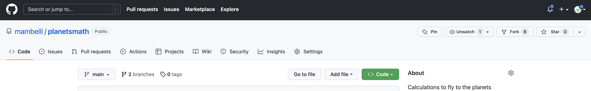
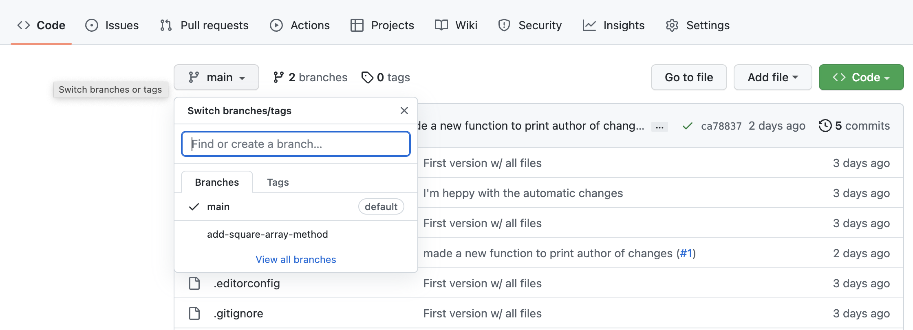
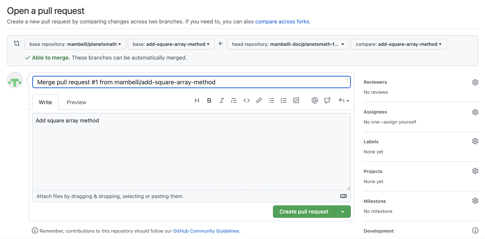

Often, we want to work on a set of changes that are more complicated than what was shown in the last lesson, and without affecting other people's work. Think for example, what would happen if I made a change to code that someone else was using, but left it in a broken state. They would probably not be very happy with me! To this effect, we can use a concept called 'branches' to separate works-in-progress from the known 'good' copy of the code. In general, it's considered good practice to create a branch for every piece of work that you do, and to merge these into the 'good' version regularly.

# Forking a repository

Frequently you may not have write access to a Git repository or we may want to have more control on how the changes get merged in that repository.
So we create our own personal copy of the repository, linked to the original one.
This is called a 'forked' repository, frequently but not always it has the same name of the original repository.

To create a fork go on GitHub to the page of the repository you'd like to fork, e.g. `https://github.com/vlad/planets.git`, then click on the 'fork' button, close to the top roght of the windows:

A new page will let you choose the details of the fork:
- the owner, you or one of your organizations
- the name of the repository, by default the same as the forked repository (unless there is a conflict in your space)

Let's say you are wolfsman and forked the repository maintaining the name.
Now you can clone your personal copy:
~~~
$ git clone git@github.com:wolfsman/planets.git ~/Desktop/planets
~~~
{: .bash}

# Creating a new branch with changes

To create a new branch, run the following command in your repository:
 
~~~
$ git checkout -b add-square-array-method
~~~
{: .bash}
~~~
Switched to a new branch 'add-square-array-method'
~~~
{: .output}

This creates a separate area for us to work in and add changes. It's a bit like how we cloned the repository in a separate place in the last lesson. However, we can also push our branch to the remote repository and keep it backed up.

We'll add a function that takes in a list, and squares all of the elements in it, returning a new array. In the `src/planetsmath/` directory:
~~~
$ nano functions.py
$ tail -n 2 functions.py
~~~
{: .bash}

~~~
def square_array(list):
    return [item*item for item in list]
~~~
{: .output}

Then we'll commit it as normal:
~~~
$ git add functions.py
$ git commit -m "Add a method that squares a list"
~~~
{: .bash}

~~~
[add-square-array-method ea4141e] Add a method that squares a list
 1 file changed, 4 insertions(+)
~~~
{: .output}

Notice now that instead of saying 'main' here, it says 'add-square-array-method', showing us that our commit is on our branch. We've sort of glossed over it previously, but 'main' is the "default branch" in Git. In some older git versions this was named 'master', so you may see this instead.

Our commit is now saved in our local repository. If you want to, you can switch back to the 'main' branch by doing:

~~~
git checkout main
~~~
{: .bash}
~~~
Switched to branch 'main'
~~~
{: .output}

If you now print the file, you'll see that our new method isn't there:

~~~
cat functions.py
~~~
{: .bash}
~~~
# SPDX-FileCopyrightText: 2022 Fermi Research Alliance, LLC
# SPDX-License-Identifier: Apache-2.0

def sum_function(list):
    """
    A function which takes a list as an argument and
    returns the sum

    Parameters
    ----------
    list: list
        Must be floats or ints

    Returns
    -------
    float:
        The sum of the elements in list
    """
    sum = 0.0
    for item in list:
        sum += item
    return sum

def sum_product(list):
    product = 1.0
    for item in list:
        product *= item
    return product
~~~
{: .output}

# Pushing a new branch

We'll switch back to our branch again:
~~~
$ git checkout add-square-array-method
~~~
{: .bash}
~~~
Switched to branch 'add-square-array-method'
~~~
{: .output}

We can put our changes onto GitHub by pushing it. However, if you run `git push`, it won't immediately work:

~~~
$ git push
~~~
{: .bash}
~~~
fatal: The current branch add-square-array-method has no upstream branch.
To push the current branch and set the remote as upstream, use

    git push --set-upstream origin add-square-array-method
~~~
{: .output}

This message just means that the remote doesn't have a branch *called* add-square-array-method to push our work to. We can create one in our push just by running the command it gives us:

~~~
$ git push --set-upstream origin add-square-array-method
~~~
{: .bash}
~~~
Enumerating objects: 9, done.
Counting objects: 100% (9/9), done.
Delta compression using up to 8 threads
Compressing objects: 100% (4/4), done.
Writing objects: 100% (5/5), 460 bytes | 460.00 KiB/s, done.
Total 5 (delta 3), reused 0 (delta 0), pack-reused 0
remote: Resolving deltas: 100% (3/3), completed with 3 local objects.
remote:
remote: Create a pull request for 'add-square-array-method' on GitHub by visiting:
remote:      https://github.com/wolfsman/planetsmath/pull/new/add-square-array-method
remote:
To https://github.com/wolfsman/planetsmath.git
 * [new branch]      add-square-array-method -> add-square-array-method
Branch 'add-square-array-method' set up to track remote branch 'add-square-array-method' from 'origin'.
~~~
{: .output}

This slightly convoluted message tells us that:
 
* A new branch was created on the remote GitHub version of the repository
* Our local copy is associated with the remote branch
* We pushed that commit
* We can easily create a pull request following the link provided
* Our repository is a fork of another repository and the changes can be fed upstream by opening a Pull Request (see the next section)

New changes can be added and then pushed to the branch just by running the standard commit and push commands now. It's worth noting that `git push` only applies to the branch that you are currently working on - if you make changes on "main", then switch to the "add-square-array-method" and run `git push`, the main changes will not be uploaded to GitHub.

On GitHub, you can switch branches by using the little drop down menu:

# Add branch protection rules (requirements) in the base repository
To avoid undesired changes in the base repository usually administrators will add restrictions, e.g.:
- block regular merges (not using a PR)
- require at least one review before a Pull Request can be merged
- require status check to pass before merging

To set these requirements go to the original repository, in the "Settings" tab (the last on the right) select "Branches" from the menu on the left and under "Branch protection rules" you can press "Add rule" to add a new one or you can edit existing ones. Either ways you can click on the restrictions you'd like to enable.

# Pull (Merge) Requests

Pull requests can be used at this point to put the changes on the 'main' copy of the repository.

The easiest way to open a pull request is to use the URL suggested by Git, like 
` https://github.com/wolfsman/planetsmath/pull/new/add-square-array-method` at the end of the previos section.
Alternatively, go back to your personal repository on GitHub and since it is the result of a fork, 
it will have a pull-down "Contribute" that allows to "Open pull request":

Either way you'll get to a window where you can review and create the pull request.
The dialogue is pre-populated probably with the correct values, anyway you can use dropboxes 
pick the source and destination repository and branch, and a title and description
(similar to the comments in the Git commits). 
There are quite a few options. You should generally write a description that tells you what the changes are. If you are working on a project with other people, 'Assignees' are people who will be implementing changes (i.e. you) and reviewers are people who will check your work for any mistakes, code that could be written more elegantly, etc. - it is very good practice to get your code reviewed before merging and a GitHub project can also require that. 
Finally you can compare the content and open the pull request:

The Pull Request will be open in the base repository and you and the project members will be able to have a conversation about the changes you submitted.
There are 4 tabs in a Pull Request page:
- Conversation, summarizes the interactions and allows communications between the submitter and reviewers
- Commits, a list of Git commits included in this PR
- Checks, the result of automatic tests
- Files changed, a diff between the upstream branch and the one with the changes. This is the tab that can be used to comment the code and to ask for changes or approve the code.

A reviewer can highlight lines on the "Files changed" tab and add comments to request changes.
General comments can be added directly in the "Conversation" tab.

A reviewer could also edit a file directly in the PR (i.e. in the branch that will be merged in the repository (the submitter can block this if desired).
GitHub allows to edit files and commit changes directly on the Web. Convenient if the changes are small.

Finally the files are feady and a reviewer can approve the PR.

At this point someone with write permission on the repository can merge the PR.
There are three options:
- Create a merge commit: Preserves the original history of all commits.
- Squash and merge: Useful if the PR has meany commits not so meaningful. Remember to write a commit message capturing all the changes
- Rebase and merge: The most common if the PR branch was not shared or the base of other branches; adds all the commits on top after a rebase

Choose the most appropriate and complete the merge.
Frequently GitHub will ask to confirm the merge action.

At this point the changes have been incorporated in the destination branch, in the original repository. 
You can verify that inspecting the files.

The source branch of the PR can be deleted.

# Keeping up with upstream changes
Assuming that you are working on a project with many other collaborators, the main repository
will change frequently.

To keep your fork in sync, GitHub has a "Sync fork" pull-down in the status bar before your code (the same one where the contribute pull-down is).
In it there is a green "Update branch" button that allows you to rebase your code to the upstream content. 
Then you can push updated local copuies.
This process is fairly straight forward, especially if you keep your main/master branch as a mirror of the upstream one and do all your contribution in separate feature branches.

Alternatively, you cn manage both your fork and the upstream repo as remotes in a local clone and manually pull and rebase as desired. This gives you more control but may be more complex.
